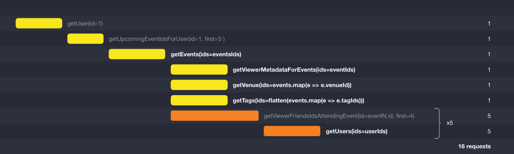
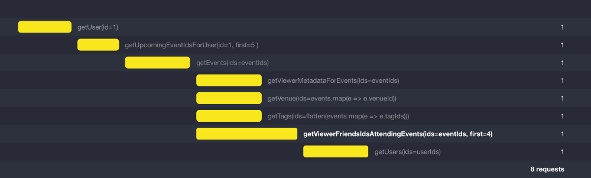
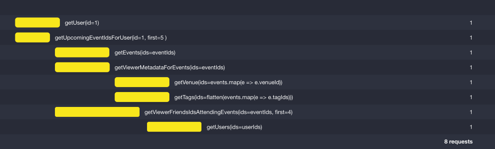

# Optimizing Your GraphQL Request Waterfalls

I'll try to implement the 4 versions of optimization introduced in this blog post:
https://dev-blog.apollodata.com/optimizing-your-graphql-request-waterfalls-7c3f3360b051#.bi8w9s6yn by @AndrewIngram

## Version 1 - Simple but slow

## Version 2 - Batching up the nodes

## Version 3 - Batching up the edges

## Version 4 - Looking ahead

