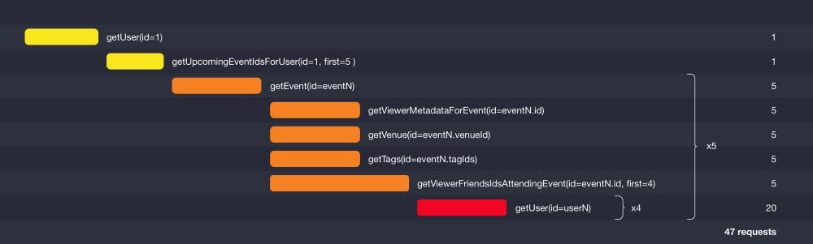

# Version 1: Simple but slow

Based on https://github.com/entria/graphql-dataloader-boilerplate



## Command

#### Setup
```bash
npm install
```
Note: If you do not have mongodb installed, please install it:
```bash
brew install mongodb
```
#### Develop
```bash
npm run watch
```

#### Production
```bash
# first compile the code
npm run build

# run graphql compiled server
npm start
```

### Flow
```bash
npm run flow
```

Or
```bash
flow
```

### REPL server
```bash
npm run repl

awesome > const user = await M.User.find()
```

Yep, await syntax works on the repl, it is awesome, tks @princejwesley (https://gist.github.com/princejwesley/a66d514d86ea174270210561c44b71ba)

### Schema
Update your schema
```bash
npm run update-schema
```

Take a look on the [Schema](https://github.com/sibelius/graphql-dataloader-boilerplate/blob/master/data/schema.graphql)
